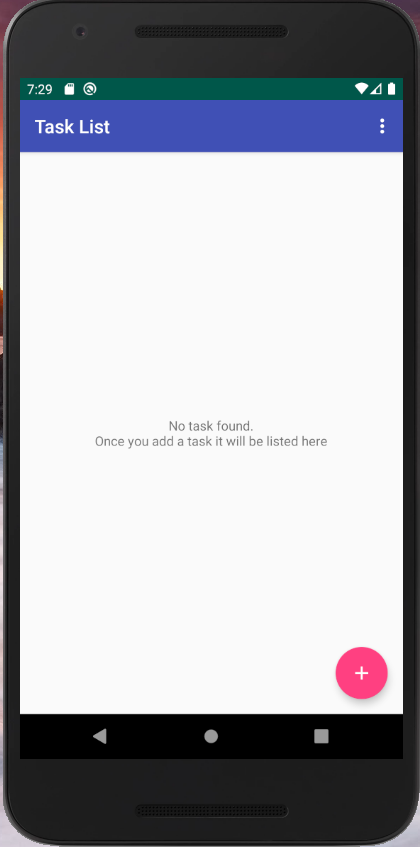
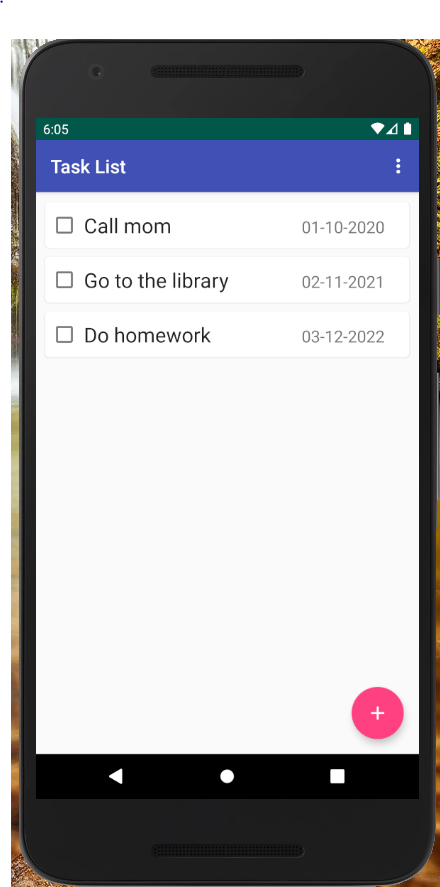
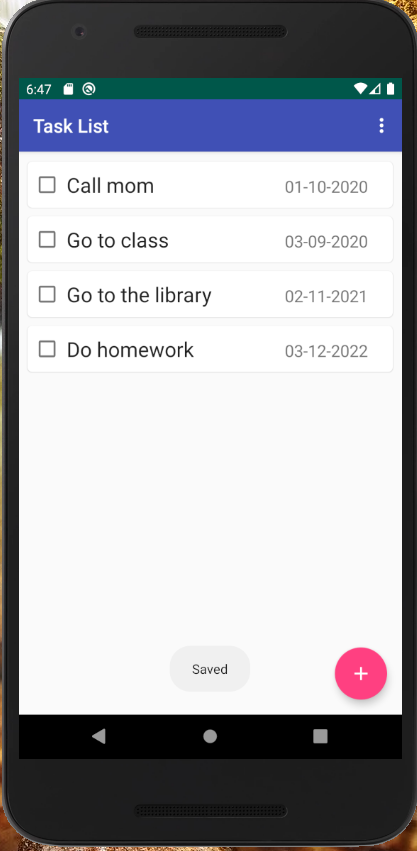
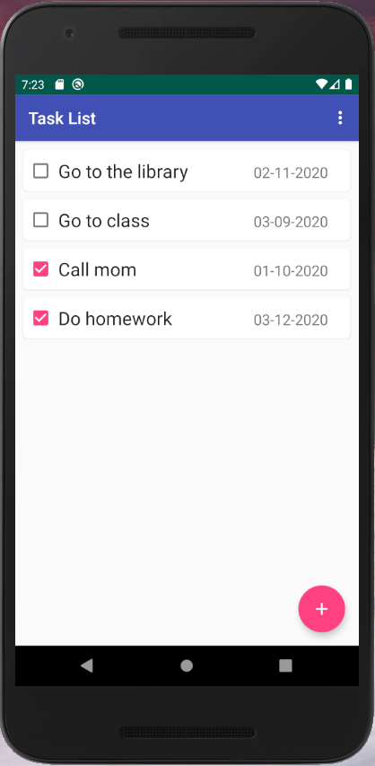
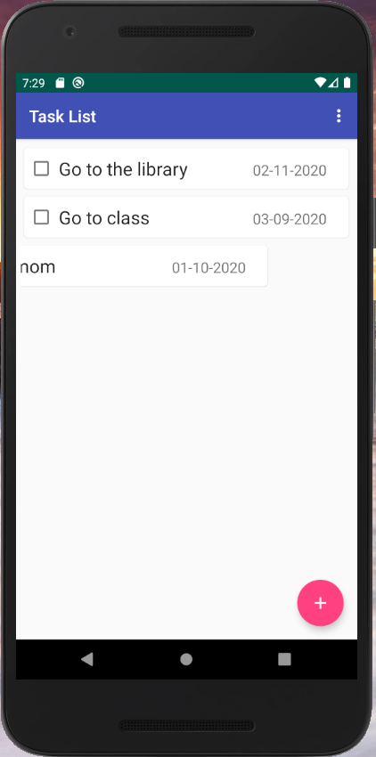
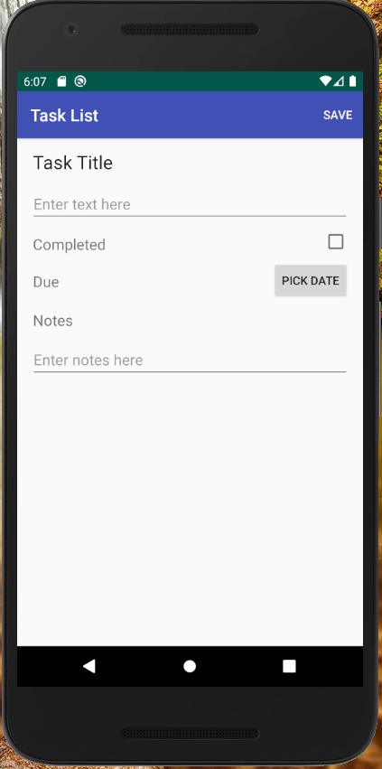
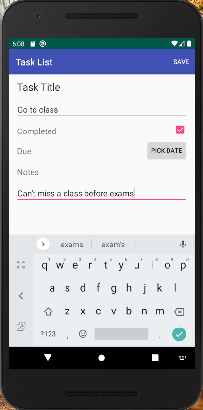
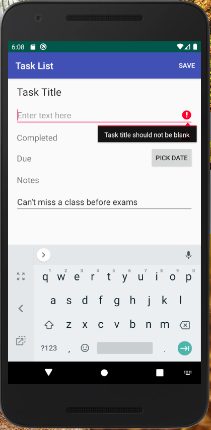
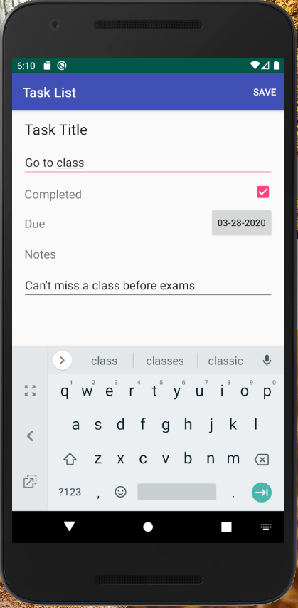

# Project 2 - Android Task List - Fazil Shaikh
### COS 470 Spring 2020   
---

## Project Title - Sour Task List

Get an organized overview of everything that needs to be done and never lose track of important tasks ever again. With **Sour Task List**, you can review upcoming tasks and create new ones with ease. Features include a task name, task description, completion status, and due date to keep it simple and straightforward. The tasks are ordered by date so you always know what to prioritize. Sour Task List helps you get stuff done! 

## Basic instructions on usage

The application loads into a list view page where all the tasks are displayed.

To create a new task:
- Click **+** on the bottom right
- Fill in the Task name, Completion status, Due date, and Notes as needed.
- Press **Save** on the top right to save the task to the home page
> **Note:**  **Task name** is a required field and the rest are optional.

To edit a new task:
- Tap on the task to be edited
- Update the fields as needed.
- Press **Save** on the top right to save the task to the home page
- Alternatively, press **Back Button** on the phone to return to the home page
> **Note:**  The home page orders tasks by date and completion.

Swiping a task right to left deletes it from the task list

## Any special info we need to run the app

**Sour Task List** users must pay an upfront fee of $999 for a one week trial and then an annual subscription fee is automatically charged to the user's credit card.
> **Note:**  Taxes and Convienience fee not included. Also, you will still find several unskippable advertisements per session.

In order to cancel your subscription follow the instructions below:
- You can't

## Lessons learned

From this project, I learned that Kotlin is easier to use than Swift. It is very similar to Java which made it simpler for me to work with. Android Studio, however, was
slow to work with. The startup sometimes took very long and it gave me strange errors from time to time. Also, the layout is a little complicated to work around. 
Nonetheless, it a good IDE with many convenient features that grew on me over time. Seems like it offers everything needed to develop for Android and I look forward to using it again soon.
The task list application turned out to be a great way to learn about the basic concepts like the built-in Kotlin functions and methods. It's a good foundation to building more complex apps.
In the beginning, I had to research some things like how passing intents between activities worked, but once I understood it, it became intuitive. Overall, a good first experience with Kotlin and Android Studio.

## Screenshots

